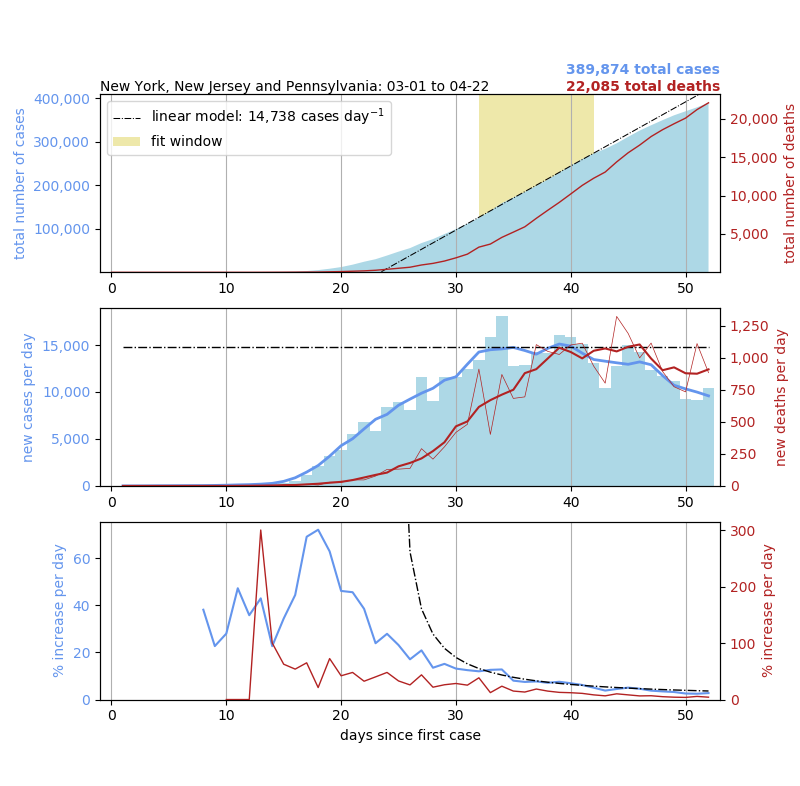

## COVID-19 and Python
### Plotting the pandemic while plodding through the pandemic

A Python script and associated functions (made with ```Python 3.7.4```) that allows you to dynamically create and analyze time series showing the progression of the novel coronavirus (COVID-19) in the United States (at the county/state level) and across the globe (at the state / country level):



The script relies upon the publicly-available database of coronavirus cases in the U.S., maintained by the New York Times [(https://github.com/nytimes/covid-19-data)](https://github.com/nytimes/covid-19-data) and the global database maintained by Johns Hopkins University [(https://github.com/CSSEGISandData/COVID-19)](https://github.com/CSSEGISandData/COVID-19). **Disclaimer:** Please note that I am not a statistician, epidemiologist or public health official. Any inferences based upon data plotted and analyzed in this script have not been vetted or peer-reviewed. COVID-19 is a global health crisis, and for the most up-to-date, reliable information, I recommend official public health organizations such as [WHO](https://www.who.int/emergencies/diseases/novel-coronavirus-2019/events-as-they-happen).